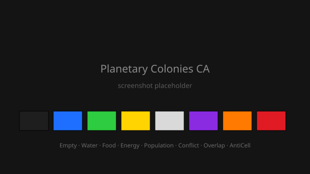

# Planetary Colonies CA

Симулятор колонии на прямоугольной сетке с ресурсами, конструкциями, стрессом и
антиклетками. Клеточный автомат на Rust + egui: все правила локальные и
детерминированные, обновление синхронное, ядро симуляции не зависит от UI.



## Запуск

```bash
cargo run --release
```

Открывается окно 1600×1000 с пустой сеткой 256×256.

Проверки:

```bash
cargo test          # 44 теста: юниты, интеграция, property-тесты
cargo clippy --all-targets
cargo build --release
```

## Управление

| Действие | Как |
|---|---|
| Рисовать активным инструментом | ЛКМ |
| Стереть клетку | ПКМ |
| Рисовать линией | перетаскивание ЛКМ |
| Зум `cell_px` (1..32) | колесо мыши |
| Инструменты | левая панель |
| Параметры и статистика | правая панель |

Инструменты: кисти `Пусто` / `Гражданин` / `Антиклетка`, штампы `Вода` / `Еда` /
`Энергия` / `Население` / `Конфликт`, генератор колонии, `Start/Pause`, `Step`,
`Reset`, `Сохранить` / `Загрузить`.

Симуляция анимируется сама: кадры запрашиваются повторно, пока статус
`Running`, поэтому мышь может оставаться неподвижной.

## Правила автомата

Тик применяет правила строго в этом порядке. Все клетки читают состояние
предыдущего поколения и пишут в буфер `next`, который подменяет сетку атомарно.

1. **Голод → AntiCell.** Гражданин с `loyalty <= 0` становится антиклеткой.
2. **Стресс → AntiCell.** Гражданин с `stress >= c_max` становится антиклеткой.
3. **Обновление CitizenData.** Для выживших граждан:
   - `Δstress = stress_hunger·hungry + stress_thirst·thirsty + stress_dark·dark + stress_over·over + conflict_sum(i)`
   - `Δfatigue = fatigue_per_tick − fatigue_rest·has_rest(i)`
   - `Δloyalty = loyalty_surplus·surplus − loyalty_deficit·deficit − loyalty_stress·(stress > c_max/2)`
4. **Вход в конструкцию.** Паттерн применяется, когда все его клетки — `Citizen`
   (или `Construction` того же типа). Граждане переносятся в `frozen`.
5. **Overlap.** Клетка, попавшая в два разных паттерна, становится `Overlap`, а
   весь связный комплекс получает множитель `×1.5`.
6. **Выход из конструкции.** Если фигура развалилась, клетки снова становятся
   гражданами, а `frozen` возвращается в `citizen`.
7. **Взрыв антиклетки.** Антиклетка рядом с регулярной клеткой уничтожает всех
   регулярных соседей и исчезает сама.
8. **Волна антиклеток.** Выжившая антиклетка шагает в первого пустого соседа по
   N4, если клетка за ним не пуста. Приоритет направлений: вверх → влево →
   вправо → вниз. Если за пустым соседом тоже пусто — шага нет.
9. **Движение граждан.** С вероятностью `p_move` гражданин переходит в пустую
   клетку N4 с минимальной плотностью (число занятых клеток в N8). Намерения
   сортируются по индексу источника; уже занятая цель пропускается.
10. **Конец игры.** Если после правил `N == 0`, симуляция останавливается и
    состояние больше не меняется.

Детекция цикла: если отпечаток состояния сетки повторился, симуляция показывает
сообщение с длиной цикла и сбрасывает колонию.

## Палитра (§8.5)

| Состояние | RGB |
|---|---|
| Empty | `#1E1E1E` |
| Citizen | `#000000` |
| Water | `#1E6FFF` |
| Food | `#2ECC40` |
| Energy | `#FFD400` |
| Population | `#D9D9D9` |
| Conflict | `#8A2BE2` |
| Overlap | `#FF7A00` |
| AntiCell | `#E01B24` |

Грани всех клеток чёрные, толщина `border_px` (0..3). При `cell_px == 1` грани не
рисуются.

Оверлеи в правой панели: тепловая карта стресса (красный), усталости (синий),
лояльности (зелёный), контуры конструкций, полупрозрачный радиус конфликта.

## Паттерны конструкций

`assets/patterns.json`, ASCII-формы, парсятся при старте. Каждый паттерн
автоматически даёт 4 вращения (0°, 90°, 180°, 270°), отражений нет.

| Паттерн | Тип | Производит |
|---|---|---|
| `water_well` | Water | 5.0 воды |
| `farm` | Food | 4.0 еды |
| `solar` | Energy | 5.0 энергии |
| `habitat` | Population | 1.0 населения |
| `conflict_zone` | Conflict | — (стресс в радиусе 3) |

Производство считается один раз на связный комплекс, а не на клетку, поэтому
2×2 `farm` даёт 4.0 еды, а не 16.0.

## Параметры

`SimConfig` (правая панель): `population_max`, `food_per_citizen`, `c_max`,
`f_max`, `l_max`, `conflict_radius`, `stress_conflict_per_tick`,
`citizen_move_enabled`, `citizen_move_prob`, `anticell_enabled`, `seed`,
`ticks_per_second`, а также резервные пороги еды/воды/энергии
(`food_reserve` / `water_reserve` / `energy_reserve`), которые задают нижнюю
границу потребности: итоговая потребность равна `max(N × per_citizen, reserve)`.

`RenderConfig`: `cell_px` (1..32), `border_px` (0..3), оверлеи, контуры и
радиус конфликта.

`seed` задаёт поведение генератора колонии и движения. Один и тот же seed при
одинаковых параметрах даёт идентичную симуляцию.

## Сохранение

`Сохранить` пишет `save.json` (сетка, `SimConfig`, `RenderConfig`, поколение) и
`save.json.ui` (состояние тулбара). Оба файла читаются при старте. Сохранение
загружается без ошибок, даже если часть полей отсутствует.

## Производительность

- Сетка — плоский `Vec<Cell>`; буфер `next` переиспользуется между тиками.
- Не более 6 тиков за кадр; дробный остаток накапливается, поэтому низкий
  `ticks_per_second` всё равно продвигает симуляцию.
- Отрисовка идёт одной `ColorImage` через `TextureHandle`; перерисовывается
  только bounding box изменившихся клеток.
- `cell_px` автоматически ограничивается так, чтобы сторона текстуры не
  превышала 2048 px — предел GPU. Для сетки 256×256 это значит `cell_px <= 8`.
- Ориентир из спецификации: 60 FPS на 256×256 при `cell_px = 4`.